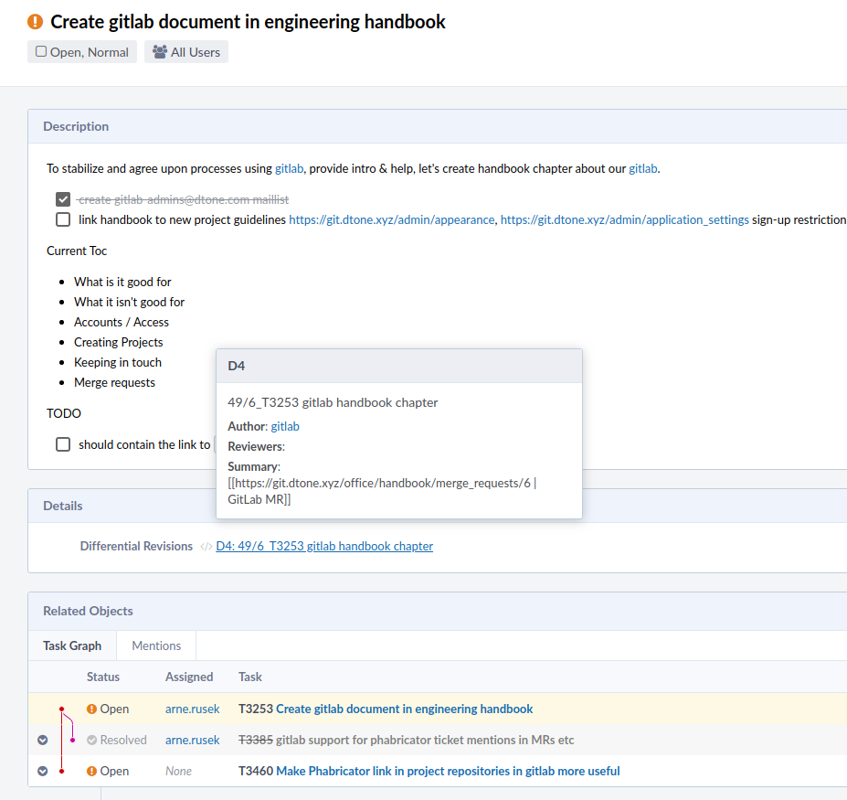

# Merge requests (MR) with GitLab

We have established a motivation for a good code-reviews in [code review guidelines](code-review). This section describes the actual flow of code-review within GitLab merge-request (referred to as MR).

To create a merge request, create a branch. Name of your branch must **always start with task idetifier** e.g `Txxxx_super_useful_feature` where Txxxx is Phabricator task (ticket) number. Description needs to start with the same `Txxxx` too for our Gitlab Phabricator integration to work. Phabricator diff will be attached to respective ticket and on merge a note will appear in your ticket's history.

## From command-line / git

If you tend to work with git, just push to a new branch and GitLab will offer you a link to create a merge request.

```
% git push
Enumerating objects: 11, done.
Counting objects: 100% (11/11), done.
Delta compression using up to 8 threads
Compressing objects: 100% (5/5), done.
Writing objects: 100% (6/6), 3.57 KiB | 1.79 MiB/s, done.
Total 6 (delta 1), reused 0 (delta 0)
remote:
remote: To create a merge request for T3253_gitlab_handbook_chapter, visit:
remote:   https://git.dtone.xyz/office/handbook/merge_requests/new?merge_request%5Bsource_branch%5D=T3253_gitlab_handbook_chapter
remote:
To git.dtone.xyz:office/handbook.git
   158bb4e..d0b15fa  T3253_gitlab_handbook_chapter -> T3253_gitlab_handbook_chapter
```

If you use an IDE that helps you create a MR, don't worry, go to [git.dtone.xyz](https://git.dtone.xyz/) and Gitlab will ask you if you want to create a MR for the branch you've just pushed.

We've implemented a [tool](https://git.dtone.xyz/office/gitlab_plugins) to synchronize merge requests to Phabricator so you don't have to link them with your Phabricator tickets anymore and you'll magically see their status in your ticket as a Phabricator differential revision. [T1877](https://phabricator.dtone.com/T1877).



You can also create changes directly in Gitlab UI either by clicking `WebIDE` on project's home page or `Edit` button when browsing a repository.

## Workflow

When creating a merge request, please:

- Put Phabricator ticket number to description as well. E.g. `T1234 My Supercool feature`.
- In case MR isn't finished, put __WIP:__ in front of the title. Gitlab will not allow merging unless __WIP:__ prefix is removed.
- Follow [code review guidelines](code-review.html#writing-code-review-description) on how to write nice title and description.
- Assign merge request to a person you believe most fit for purpose. You can also mention others in description using slash cc command: e.g. `/cc @jane.doe @john.smith` (note: many slash commands are [supported](https://git.dtone.xyz/help/user/project/quick_actions). Consider using slash commands in comment after creating MR or removing it from description before merge to keep nice git log. If you need more eyes that 2, to work around missing "multiple reviewers" feature, please make agreement with other reviewers via comments or cycle through multiple assignees.
- Assign labels to merge request if needed. This is project specific. E.g. handbook has _no changelog_ label to signal that the merge request is small and should not generate changelog entry. Or _bump major_ and _bump minor_ to signal to CI/CD to release changes with different _major_ or _minor_ version. (Note: this must be implemented in CI/CD for your project).
- Always check __Delete source branch when merge request is accepted__.
- Consider also checking __Squash commits when merge request is accepted__. All commits in your MR will be "squashed" into one commit. Git log will then contain just MR's title and description (and a merge commit, but don't worry about that). If you're doing a really large MR where it might make sense to keep commits from that MR split to ease the code review process (splitting it to parts per commit, show your process or group changes), you'll have much more freedom when commiting to MR's branch regarding commit logs, fixes, merges from master etc. when you use "squash". Git log message will still be nice and readable making sense in the context of the whole project even if you commit stuff like "fixes" and "more fixes" into the MR (which is a no-no in the "official" log).
- Always double-check the merge and squash commit messages. You will typically find yourself clicking on `Include merge request description` and removing the first line talking about merging particular branch to master.

## Reviewer

After a [thorough code review](code-review), reassign your MR back to the author to clearly signal you've finished.

## Who merges

Always leave merging to the author unless it's an emergency. In case git repository contains CI/CD pipelines that will lead to deployments it might be that change requires testing right after deployment or you can deploy the changes in wrong time.
