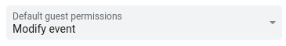
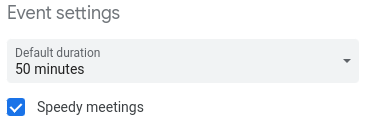

# Better sharing and collaboration

## Google Calendar

Google Calendar is an essential tool for planning time, thus for allowing people to schedule calls and meet each other.

### Allow access to your calendar

Go to `Settings` and click on your calendar:

Make sure, that you have allowed other in the company to see your events:

### Allow guest to modify invites

Please make sure, that you have set `Default guest permission` under `Settings -> General -> Event settings` to `Modify event` (or at least to `Invite others`).

This setting will allow your guests to add other people to meetings, add dial-in details, extend description etc.

### Speedy meetings

We suggest using `Speedy meetings` also under `Settings -> General -> Event settings`.

That shortens up meetings a bit -- end 30 minute meetings 5 minutes early and longer meetings 10 minutes early. That will allow people to have consecutive meetings scheduled (have you ever came late to meeting because you need to go to the bathroom?).

### Working hours

Set your working hours to give hint to the others, when they should be scheduling meetings with you.

### World clock

Google Calendar has built in simple world clock. I find it quite useful for making a quick decision if I am going to reach out to someone or send an email. You can set it as follows

.

That will result into

.

### Holidays in different countries

You may have spotted an automatic calendar tracking holidays in your home country. It looks like this for me:

You can easily add other countries. For example if you want to add Kenyan, you just need to `+ -> Browse calendars of interest -> Regional holidays -> Kenya` as shown below.

## Donut Calls

We have established a regular bi-weekly [donut](https://www.donut.com/pairing/) calls. These calls about meeting different people in the organization. Learning about them, their lives, family, hobbies. But also chatting about what they do in the organization. Frequently, you will find out, that you can easily help with somebody with something what they consider tedious. If you are software engineer, some simple automation can do a lot for person in finance.

Please, please, please, attend them. Be on time and spend the call chatting. We suggest scheduling donut call for 20 minutes.

### How to snooze pairing

Pairing is happening on weekly basis. Sometimes you need to skip the cycle (for example your are going to have vacation). You have two options.

#### Snooze pairing

Got to Slack and find the pairing bot. Its name is `@donut` (for example, you can hit `Ctrl-K` and type `donut`). Send it message `help`. It will present you with option to snooze pairing in return. The whole session may look like the following picture.

You can choose for how long you want to snooze pairing from the drop-down.

#### (Semi-)Permanently disabling pairing

Other option is simply to leave the pairing channel. Simple leave channel `#donuts`, that will stop you from being considered for donut calls. You can return any time you want.

Please, remember to join back as we will be missing you otherwise!

## Slack

We are using Slack for semi real-time, simple communication. That means, that

- Nobody is required to response on Slack. Slack is treated as strictly **best-effort** communication platform. Only exception being `#mission_control` channel for critical operational issues.
- People will probably overlook messages in channels, when they get back from vacation.
- Please, don't sent messages, which really should go via email:

  - you don't require "immediate" response.
  - person on the other side, will either need to put effort into understanding your question/comment and/or she will need to put effort into responding. Basically, if you are writing something what is longer than 3 sentences, that should probably go to email or ticket.

- We tend to use Slack as a type of "social network". There are channels for casual conversations, sharing interesting links etc.

### Working hours at Slack

It is frequently convenient to mention somebody (those `@antonin.kral`). That will mark particular message and typically trigger more aggressive notification being sent to person. Frequently, one don't need to send the notification straight away. E.g. I am mentioning somebody who is already out of the office (maybe she is in different office, or maybe I am working over-time). I don't want her to respond immediately, but I want to mark the message for her...

It is **your** responsibility to set up working hours. You should do two things:

1. check your home timezone at https://dtoneworkspace.slack.com/account/settings . Mine looks like this 
1. open [user profile](https://app.slack.com/client/user_profile/). Click on "more options" (tree dots) and select `View prefereces`. You will be able to find `Do not Disturb` settings under `Notifications`. Mine looks like this 

## Daily Standups

Having a daily stand up is an important part of knowledge sharing. That includes, but it is not limited to:

- what others are doing (to sync or avoid duplication, give opportunity to cooperate);
- express dependencies (e.g. I am waiting for some other event to happen before I can continue with my work);
- highlighting (semi-)important events, new projects, merge request (doesn't replace email for important notifications, but helps with spreading the information);
- highlighting interesting information sources (for example mentioning that interesting meeting happened and where are meeting minutes, mentioning an interesting article or task);
- status update about future plans (are we on track with our long-term goals, is some change in direction coming).

But physical standups (round tables) are frequently non-effective and actually quite hard to follow and don't give opportunity to dig deeper into topics which interests you. Also having a physical standup effectively prevents anybody from a different time-zone to participate.

To address these issues, we have introduced a **written standup**. It works as follows:

- Bot creates an empty document every midnight UTC. File will be created under [standups folder on Google Drive](https://drive.google.com/drive/folders/1v7t8dYIufpz3RUECr9uMToK2A-ZAlidw). It follows naming schema of `{year}/{month}/{year}-{month}-{day}_standup`. Documents are made as copies of a [template](https://docs.google.com/document/d/1ZIqVFjTECYCtPLonI0h5d7KVFDte-a6C2flm7Vx1T9Q/edit). So in case, you want to update how standups are going to look like in the future, just edit this document.
- Everybody has her/his section in the document.
- Your record in the document should be finalized by the **end of your work day**. In other words -- you are supposed to be capturing what you have *done the same day* or what are you *planning to be doing next day*. It doesn't typically talk about yesterday (in contrast to typical standup).
- Always provide context to allow people to understand the update (links to phabricator tasks, gitlab projects, merge requests or just link what ever you are talking about).
- If somebody asked a question / requested more details via comment, always consider updating your record in the document (in contrast to just replying to the comment). Any consecutive reader will benefit from updated text.

Please, be reasonable in picking topics to write about. You don't need to cover every single email you have read. Similarly, it would be interesting to make a research around various cuisine across the whole company, but this is not really the place to share what you had for lunch. Basically, always keep on mind, that somebody is going to read it, so pick what is valuable for potential readers.

Benefits:

- One can read way faster then listen/speak. So you can cover way more people when reading their notes.
- Having a links to additional resources give opportunity to dig a bit deeper and ask meaningful questions.
- Google Document allows for inline comments which became a great tool for asking additional information asynchronously.
- It is fair for everybody, despite their schedules or time-zones. It turned to be really valuable for us, as we have teams around the globe (Asia, Africa, Europe, Americas). Standup basically follows the sun.
- Allows people who are for any reason missing on a particular standup to catch up easily.
- Produces body of *searchable* and *rich* documents.
- It also helps you to see what you have achieved during the day. And get the sense of accomplishment, which is otherwise challenging to get at knowledge jobs.
