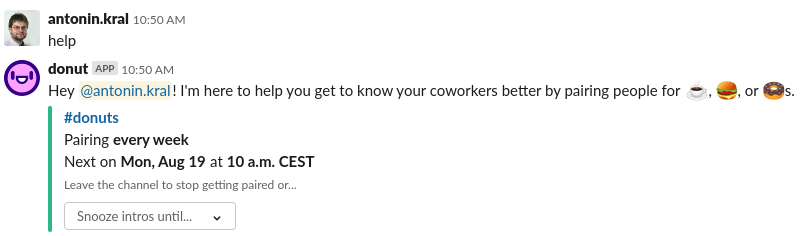

# Donut Calls

We have established a regular weekly [donut](https://www.donut.com/pairing/) calls. These calls about meeting different people in the organization. Learning about them, their lives, family, hobbies. But also chatting about what they do in the organization. Frequently, you will find out, that you can easily help with somebody with something what they consider tedious. If you are software engineer, some simple automation can do a lot for person in finance.

Please, please, please, attend them. Be on time and spend the call chatting.

## How to snooze pairing

Pairing is happening on weekly basis. Sometimes you need to skip the cycle (for example your are going to have vacation). You have two options.

### Snooze pairing

Got to Slack and find the pairing bot. Its name is `@donut` (for example, you can hit `Ctrl-K` and type `donut`). Send it message `help`. It will present you with option to snooze pairing in return. The whole session may look like the following picture.

You can choose for how long you want to snooze pairing from the drop-down.

### (Semi-)Permanently disabling pairing

Other option is simply to leave the pairing channel. Simple leave channel `#donuts`, that will stop you from being considered for donut calls. You can return any time you want.

Please, remember to join back as we will be missing you otherwise!
