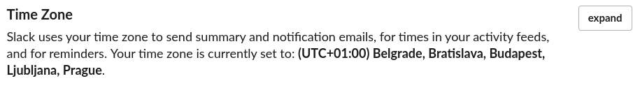
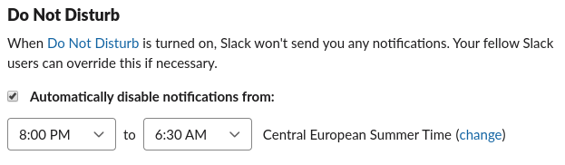

# Slack

We are using Slack for semi real-time, simple communication. That means, that

- Nobody is required to response on Slack. Slack is treated as strictly **best-effort** communication platform. Only exception being `#mission_control` channel for critical operational issues.
- People will probably overlook messages in channels, when they get back from vacation.
- Please, don't sent messages, which really should go via email:

  - you don't require "immediate" response.
  - person on the other side, will either need to put effort into understanding your question/comment and/or she will need to put effort into responding. Basically, if you are writing something what is longer than 3 sentences, that should probably go to email or ticket.

- We tend to use Slack as a type of "social network". There are channels for casual conversations, sharing interesting links etc.

## Working hours

It is frequently convenient to mention somebody (those `@antonin.kral`). That will mark particular message and typically trigger more aggressive notification being sent to person. Frequently, one don't need to send the notification straight away. E.g. I am mentioning somebody who is already out of the office (maybe she is in different office, or maybe I am working over-time). I don't want her to respond immediately, but I want to mark the message for her...

It is **your** responsibility to set up working hours. You should do two things:

1. check your home timezone at https://dtoneworkspace.slack.com/account/settings . Mine looks like this 
1. open [user profile](https://app.slack.com/client/user_profile/). Click on "more options" (tree dots) and select `View prefereces`. You will be able to find `Do not Disturb` settings under `Notifications`. Mine looks like this 
