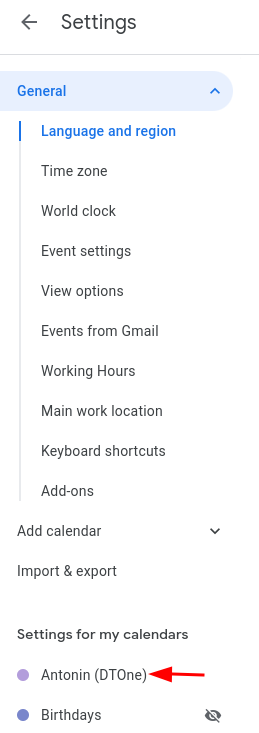

# Tips for sharing

Couple things about how to set or use various tools to simplify sharing.

## Google Calendar

Google Calendar is an essential tool for planning time, thus for allowing people to schedule calls and meet each other.

### Allow access to your calendar

Go to `Settings` and click on your calendar:

Make sure, that you have allowed other in the company to see your events:

### Allow guest to modify invites

Please make sure, that you have set `Default guest permission` under `Settings -> General -> Event settings` to `Modify event` (or at least to `Invite others`).

This setting will allow your guests to add other people to meetings, add dial-in details, extend description etc.

### Speedy meetings

We suggest using `Speedy meetings` also under `Settings -> General -> Event settings`. 

That shortens up meetings a bit -- end 30 minute meetings 5 minutes early and longer meetings 10 minutes early. That will allow people to have consecutive meetings scheduled (have you ever came late to meeting because you need to go to the bathroom?).

### Working hours

Set your working hours to give hint to the others, when they should be scheduling meetings with you.

### World clock

Google Calendar has built in simple world clock. I find it quite useful for making a quick decision if I am going to reach out to someone or send an email. You can set it as follows , which will result into .